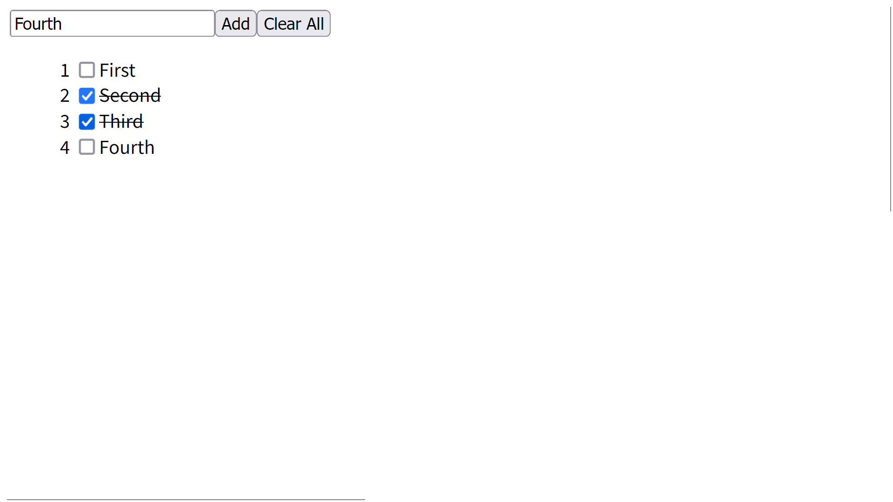
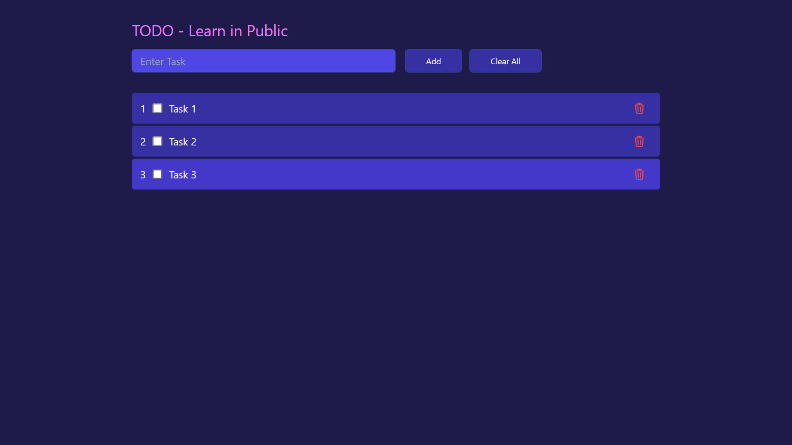

<!-- this is a learn in public concept project where i will make a todo app in react and post every day progress online on twitter -->
# Learn in Public - React Todo App

This is a learn in public concept project where I will make a todo app in react and post every day progress online on twitter.

## Day 1
- Created a new react app using vite `npx create-vite@latest react-todo-app`
- Added simple todo list fuctionalities

> I have added the following functionalities
- Added delete button to delete all todos
- user can add new todo by typing in the input field and clicking on the add button
- user can click on a todo to mark it as completed a strike through line will appear on the todo
user can click on the ClearAll button to delete all todos

<!-- screen shot -->

## Day 2
<!--learned how to use components in react and how to pass props. added styling theme using tailwind css and added fuctionality of deleting a single task -->
- Learned how to use components in react and how to pass props.
- Added styling theme using tailwind css
- Added functionality of deleting a single task

> I have added the following functionalities
- Added a new component `Button` and `Heading`
- Added a new button to delete a single task
- clicking on the task will toggle the task as completed

<!-- screen shot -->

<!-- video -->
[Day 2 (Video)](./videos/day2.mp4)

